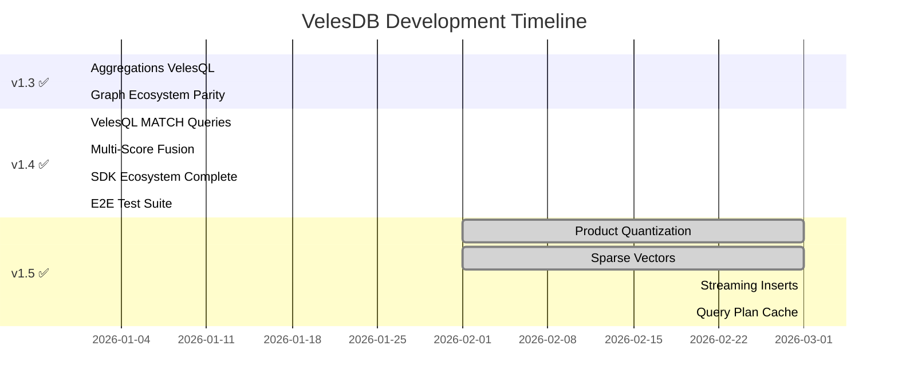
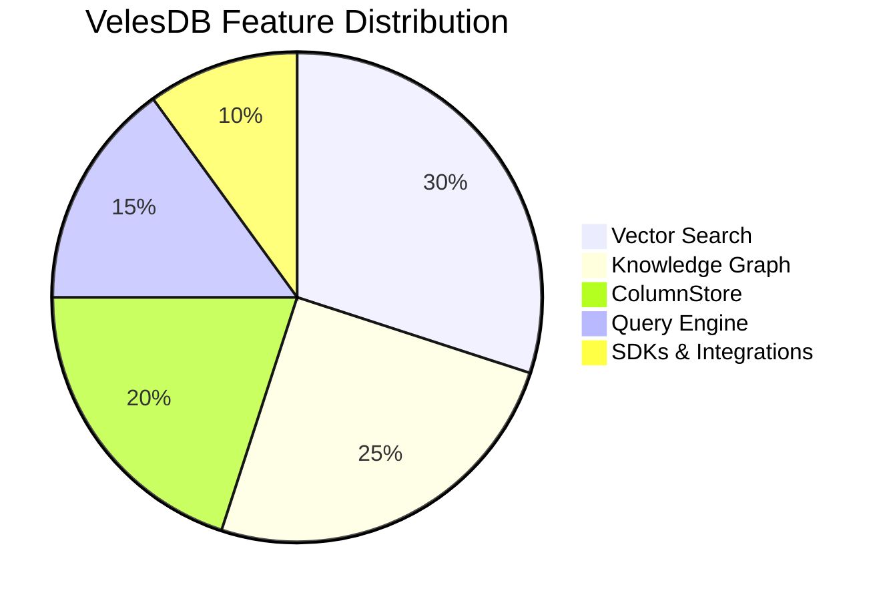

<p align="center">
  
</p>

<h1 align="center">
  
</h1>

<h3 align="center">
  🧠 <strong>The Local Knowledge Engine for AI Agents</strong> 🧠<br/>
  <em>Vector + Graph + ColumnStore Fusion • 39µs HNSW Search • 16ns SIMD • 3,670+ Tests • 82% Coverage</em>
</h3>

<p align="center">
  <strong>🚀 v1.5.1 Released</strong> — Product Quantization, Sparse Vectors, Hybrid Search, Streaming Inserts, Query Plan Cache<br/>
  <a href="https://github.com/cyberlife-coder/VelesDB/releases/tag/v1.5.1">Download Now</a> • <a href="#-quick-start">Quick Start</a> • <a href="#-whats-new-in-v15">What's New</a>
</p>

<p align="center">
  <a href="https://github.com/cyberlife-coder/VelesDB/actions"></a>
  <a href="https://app.codacy.com/gh/cyberlife-coder/VelesDB/dashboard?utm_source=gh&utm_medium=referral&utm_content=&utm_campaign=Badge_grade"></a>
  <a href="https://github.com/cyberlife-coder/VelesDB/blob/main/LICENSE"></a>
  <a href="https://github.com/cyberlife-coder/VelesDB"></a>
  <a href="https://deepwiki.com/cyberlife-coder/VelesDB"></a>
  <a href="https://zread.ai/cyberlife-coder/VelesDB"></a>
</p>

<p align="center">
  
  <a href="https://github.com/cyberlife-coder/VelesDB/actions/workflows/ci.yml"></a>
  
  
  
  
  
</p>

<p align="center">
  <a href="https://crates.io/crates/velesdb-core"></a>
  <a href="https://crates.io/crates/velesdb-server"></a>
  <a href="https://crates.io/crates/velesdb-cli"></a>
  <a href="https://crates.io/crates/velesdb-migrate"></a>
  <a href="https://crates.io/crates/velesdb-mobile"></a>
  <a href="https://crates.io/crates/tauri-plugin-velesdb"></a>
</p>

[](https://star-history.com/#cyberlife-coder/velesdb&Date)

---

## 🆕 What's New in v1.5

### Product Quantization (PQ) -- 4x Memory Compression

Train a codebook on your vectors and compress them from 32-bit floats to compact codes. Configurable subspaces (m) and centroids (k), with OPQ pre-rotation for clustered data and RaBitQ binary quantization (32x compression). ADC search uses SIMD-accelerated lookup tables that fit in L1 cache. Rescore oversampling (default 4x) prevents silent recall collapse.

```sql
-- Train a PQ quantizer on your collection
TRAIN QUANTIZER ON my_collection WITH (m=8, k=256)

-- Search uses PQ automatically after training (ADC + rescore)
SELECT * FROM my_collection WHERE vector NEAR $query LIMIT 10
```

```python
# Python SDK
db.train_pq("my_collection", m=8, k=256)
collection = db.get_collection("my_collection")
results = collection.search(vector=query_vec, top_k=10)
```

### Sparse Vector Search -- SPLADE/BM42-Compatible

Native inverted index with SPLADE/BM42-compatible term_id:weight format. MaxScore DAAT algorithm with early termination for sub-millisecond ANN search. Named sparse vectors per point with WAL persistence and automatic compaction. Supports inner-product scoring out of the box.

```sql
-- Sparse vector search
SELECT * FROM docs WHERE vector SPARSE_NEAR $sv LIMIT 10
```

```python
# Python SDK -- unified search with optional sparse_vector
results = collection.search(sparse_vector={42: 0.8, 137: 0.6, 891: 0.3}, top_k=10)
```

### Hybrid Dense+Sparse Search -- Best of Both Worlds

Combine dense semantic similarity with sparse lexical matching in a single query. RRF (Reciprocal Rank Fusion) and RSF (Reciprocal Score Fusion) strategies merge results from both branches. Parallel execution via rayon for minimal latency overhead.

```sql
-- Hybrid search with RRF fusion
SELECT * FROM docs
WHERE vector NEAR $dense AND vector SPARSE_NEAR $sparse
USING FUSION(strategy='rrf', k=60)
LIMIT 10
```

```json
// REST API -- unified search endpoint auto-detects hybrid mode
POST /collections/docs/search
{
  "vector": [0.1, 0.2, 0.3],
  "sparse_vector": {"42": 0.8, "137": 0.6},
  "top_k": 10
}
```

### Streaming Inserts -- Immediately Searchable

Bounded channel with backpressure (HTTP 429 when full). Inserted vectors are immediately searchable via a delta buffer that merges with HNSW results at query time. Micro-batch draining into HNSW with configurable batch size (default 128). Delta-wins dedup strategy ensures freshest data is always returned.

```python
# Python SDK -- stream inserts without blocking
collection = db.get_collection("my_collection")
collection.stream_insert([
    {"id": "p1", "vector": vec1, "payload": {"text": "hello"}},
    {"id": "p2", "vector": vec2, "payload": {"text": "world"}},
])
# Immediately searchable -- no rebuild wait
results = collection.search(vector=query_vec, top_k=10)
```

### Query Plan Cache -- Compiled Plan Reuse

Two-level compiled plan cache (AST + execution plan) with LRU eviction. Automatic invalidation via per-collection `write_generation` counter and schema version tracking. Observable via `EXPLAIN` output (`cache_hit`, `plan_reuse_count`) and `/metrics` Prometheus endpoint.

```sql
-- Check if your query hits the plan cache
EXPLAIN SELECT * FROM docs WHERE vector NEAR $v LIMIT 10
-- Output includes: cache_hit: true, plan_reuse_count: 42
```

---

## 🎯 The Problem We Solve

> **"My RAG agent needs both semantic search AND knowledge relationships. Existing tools force me to choose or glue multiple systems together."**

### Three Pain Points That Cost You Time & Money

| Pain Point | Business Impact | VelesDB Solution |
|------------|-----------------|------------------|
| **🐌 Latency kills UX** | Cloud vector DBs add 50-100ms/query. 10 retrievals = **1+ second delay** | **<0.11ms local** — network-free retrieval |
| **🔗 Vectors alone aren't enough** | Semantic similarity misses relationships ("Who authored this?") | **Vector + Graph unified** in one query |
| **🔒 Privacy & deployment friction** | Cloud dependencies, API keys, GDPR concerns | **15MB binary** — works offline, air-gapped |

### 💰 The ROI of Switching to VelesDB

| Metric | Before (Cloud Stack) | After (VelesDB) | Savings |
|--------|---------------------|-----------------|---------|
| **Infrastructure** | 3 databases + sync | 1 binary | **70% less code** |
| **Cloud costs** | $500-5000/mo | $0 (local) | **100% savings** |
| **Latency** | 100-300ms | < 1ms | **100x faster** |
| **Compliance** | Complex (data leaves premises) | Simple (local-first) | **HIPAA/GDPR ready** |
| **Dev time** | 3 integrations to maintain | 1 API | **3x faster shipping** |

---

## 🏆 Why Developers Choose VelesDB

<table align="center">
<tr>
<td align="center" width="25%">
<h3>🧠 Vector + Graph + Columns</h3>
<p>Unified semantic search, relationships, AND structured data.<br/><strong>No glue code needed.</strong></p>
</td>
<td align="center" width="25%">
<h3>⚡ 16.2ns SIMD</h3>
<p>Native HNSW + AVX2 SIMD.<br/><strong>47.4 Gelem/s throughput.</strong></p>
</td>
<td align="center" width="25%">
<h3>📦 15MB Binary</h3>
<p>Zero dependencies.<br/><strong>Works offline, air-gapped.</strong></p>
</td>
<td align="center" width="25%">
<h3>🌍 Run Anywhere</h3>
<p>Server, Browser, Mobile, Desktop.<br/><strong>Same Rust codebase.</strong></p>
</td>
</tr>
</table>

---

## 📊 Project Quality Metrics

> **Production-ready with enterprise-grade quality assurance**

<table align="center">
<tr>
<td align="center" width="20%">
<h3>🧪 3,670+</h3>
<p><strong>Tests</strong><br/>100% passing</p>
</td>
<td align="center" width="20%">
<h3>📈 82.30%</h3>
<p><strong>Code Coverage</strong><br/>Line coverage</p>
</td>
<td align="center" width="20%">
<h3>🔒 0</h3>
<p><strong>Security Issues</strong><br/>cargo deny clean</p>
</td>
<td align="center" width="20%">
<h3>⚡ 16.2 ns</h3>
<p><strong>Dot Product</strong><br/>768D vectors</p>
</td>
<td align="center" width="20%">
<h3>🎯 100%</h3>
<p><strong>Recall@10</strong><br/>Accurate mode</p>
</td>
</tr>
</table>

### Performance by the Numbers

| Benchmark | Result | Context |
|-----------|--------|---------|
| **SIMD Dot Product (768D)** | 16.2 ns | 47.4 Gelem/s |
| **SIMD Cosine (768D)** | 29.6 ns | 25.9 Gelem/s |
| **SIMD Hamming (768D)** | 35.3 ns | — |
| **HNSW Search (10K vectors)** | 38.6 µs | k=10, 768D, measured 2026-03-11 |
| **VelesQL Cache Hit** | 1.05 µs | ~952K QPS, measured 2026-03-11 |
| **Sparse Search (10K)** | 732 µs (top10) / 708 µs (top100) | MaxScore DAAT, measured 2026-03-11 |

> \*Measured on i9-14900KF, Windows 11, Rust 1.92.0. Latency depends on CPU/flags/dataset.

### Codebase Health

| Metric | Value |
|--------|-------|
| **Total Rust LoC** | ~48,000 (workspace crates) |
| **Crates** | 8 production crates |
| **Benchmarks** | 38 criterion suites |
| **E2E Test Suites** | 6 (Rust, Python, WASM, CLI, LangChain, LlamaIndex) |
| **Security Advisories** | 0 ✅ |

### Quality Gates (CI/CD)

```
✅ cargo check --workspace
✅ cargo clippy -- -D warnings  
✅ cargo test --workspace (3,670+ passing)
✅ cargo deny check (0 advisories)
✅ cargo fmt --check
✅ Code coverage > 75% (82.30%)
```

> 📊 **Full metrics:** [docs/BENCHMARKS.md](docs/BENCHMARKS.md)

---

## 🏢 Coming From Another Vector DB?

| If you use... | VelesDB gives you... |
|---------------|----------------------|
| **Pinecone** | No API keys, no cloud costs, **100x faster locally**, + Graph + Columns |
| **Qdrant** | Single binary (15MB vs 100MB+), native WASM/Mobile, **unified Vector+Graph** |
| **Milvus** | Zero config vs complex cluster setup, **embedded mode** |
| **pgvector** | Purpose-built for vectors, **12-100x faster search**, native graph support |
| **ChromaDB** | Production-grade Rust vs Python prototype, **enterprise-ready** |
| **Neo4j + Pinecone** | **One database instead of two**, unified query language |

```sql
-- The query that defines VelesDB: Vector + Graph in ONE statement
MATCH (doc:Document)-[:AUTHORED_BY]->(author:Person)
WHERE similarity(doc.embedding, $question) > 0.8
  AND doc.category = 'research'
RETURN author.name, author.email, doc.title
ORDER BY similarity() DESC
LIMIT 5;
```

**This query would require 2 databases and complex sync logic elsewhere. With VelesDB: one query, sub-millisecond response.**

---

## 🌍 Full Ecosystem / Écosystème Complet

VelesDB is designed to run **where your agents live** — from cloud servers to mobile devices to browsers.

| Domain      | Component                          | Description                              | Install                     |
|-------------|------------------------------------|------------------------------------------|----------------------------|
| **🦀 Core** | [velesdb-core](crates/velesdb-core) | Core engine (HNSW, SIMD, VelesQL)        | `cargo add velesdb-core`   |
| **🌐 Server**| [velesdb-server](crates/velesdb-server) | REST API (25 endpoints, OpenAPI optionnelle) | `cargo install velesdb-server` |
| **💻 CLI**  | [velesdb-cli](crates/velesdb-cli)   | Interactive REPL for VelesQL             | `cargo install velesdb-cli` |
| **🐍 Python** | [velesdb-python](crates/velesdb-python) | PyO3 bindings + NumPy                    | `pip install velesdb`      |
| **📜 TypeScript** | [typescript-sdk](sdks/typescript) | Node.js & Browser SDK                    | `npm i @wiscale/velesdb-sdk`   |
| **🌍 WASM** | [velesdb-wasm](crates/velesdb-wasm) | Browser-side vector search               | `npm i @wiscale/velesdb-wasm` |
| **📱 Mobile** | [velesdb-mobile](crates/velesdb-mobile) | iOS (Swift) & Android (Kotlin)           | [Build instructions](#-mobile-build) |
| **🖥️ Desktop** | [tauri-plugin](crates/tauri-plugin-velesdb) | Tauri v2 AI-powered apps               | `cargo add tauri-plugin-velesdb` |
| **🦜 LangChain** | [langchain-velesdb](integrations/langchain) | Official VectorStore                   | `pip install langchain-velesdb` |
| **🦙 LlamaIndex** | [llamaindex-velesdb](integrations/llamaindex) | Document indexing                     | `pip install llama-index-vector-stores-velesdb` |
| **🔄 Migration** | [velesdb-migrate](crates/velesdb-migrate) | From Qdrant, Pinecone, Supabase        | `cargo install velesdb-migrate` |

---

## 🎯 Use Cases

| Use Case                      | VelesDB Feature                     |
|-------------------------------|-------------------------------------|
| **RAG Pipelines**             | Sub-ms retrieval                    |
| **AI Agents**                 | Embedded memory, local context      |
| **Desktop Apps (Tauri/Electron)** | Single binary, no server needed     |
| **Mobile AI (iOS/Android)**   | Native SDKs with 32x memory compression |
| **Browser-side Search**       | WASM module, zero backend           |
| **Edge/IoT Devices**          | 15MB footprint, ARM NEON optimized  |
| **On-Prem / Air-Gapped**      | No cloud dependency, full data sovereignty |

---

## 🧭 New to `velesdb-core` and VelesQL? Quick diagnosis (first-hour issues)

If you're new to VelesDB, most "it doesn't work" moments come from a **model mismatch**, not from runtime bugs.

### Symptom → probable cause → immediate fix

| Symptom | Probable cause | Immediate fix |
|---|---|---|
| `MATCH` query fails or behaves unlike SQL | VelesQL is SQL-like, not PostgreSQL/MySQL-compatible SQL | Start from VelesQL examples, then adapt queries incrementally |
| Query returns 0 rows | Vector dimension mismatch, strict threshold, or empty collection | Verify dimension first, remove strict filters, retest |
| Can't change metric/dimension after create | Collection schema is intentionally immutable for HNSW/SIMD performance | Create a new collection and reindex data |
| Installed `velesdb-core` but no HTTP endpoint/REPL | `velesdb-core` is embedded engine only | Add `velesdb-server` (HTTP) and/or `velesdb-cli` (REPL) |
| Benchmarks don't match your machine | Hardware/workload/config differences (`ef_search`, payload, filters) | Benchmark with your real dataset and query distribution |

### Fast sanity sequence (recommended)

1. Confirm embedding dimension == collection dimension.
2. Run a permissive nearest-neighbor query (no strict filters).
3. Validate at least one known inserted vector is retrievable.
4. Add thresholds and metadata filters progressively.
5. Tune `ef_search` after functional correctness is validated.

For an actionable bilingual checklist (EN + FR), see **[docs/NEW_USER_TROUBLESHOOTING.md](docs/NEW_USER_TROUBLESHOOTING.md)**.

---

## 🎪 Demos & Examples

> **See VelesDB in action** with production-ready examples demonstrating real-world use cases.

### ⭐ Flagship: E-commerce Recommendation Engine

The ultimate showcase of VelesDB's **Vector + Graph + MultiColumn** combined power:

```bash
cd examples/ecommerce_recommendation
cargo run --release
```

| Feature | Details |
|---------|---------|
| **📦 Dataset** | 5,000 products, 128-dim embeddings, 11 metadata fields |
| **🔗 Graph** | ~20,000 co-purchase relationships |
| **🔍 Query Types** | Vector similarity, Filtered search, Graph lookup, Combined |

#### Measured Performance (5,000 products, 128D)

| Query Type | Latency | Description |
|------------|---------|-------------|
| **Vector Similarity** | **187 µs** | Find semantically similar products |
| **Vector + Filter** | **55 µs** | In-stock, price < $500, rating ≥ 4.0 |
| **Graph Lookup** | **88 µs** | Co-purchased products (BOUGHT_TOGETHER) |
| **Combined (Full Power)** | **202 µs** | Union of Vector + Graph + Filters |

> 💡 **Real-world latency** — includes payload retrieval, filtering, and result construction. Pure HNSW search measured **96-106 µs** on 2026-02-17 (best-case reference: 57 µs).

**Includes 15 Playwright E2E tests** validating data generation, query execution, and performance thresholds.

📖 **Full documentation:** [examples/ecommerce_recommendation/README.md](examples/ecommerce_recommendation/README.md)

### Other Demos

| Demo | Description | Tech |
|------|-------------|------|
| [**rag-pdf-demo**](demos/rag-pdf-demo/) | PDF document Q&A with RAG | Python, FastAPI |
| [**tauri-rag-app**](demos/tauri-rag-app/) | Desktop RAG application | Tauri v2, React |
| [**wasm-browser-demo**](examples/wasm-browser-demo/) | In-browser vector search | WASM, vanilla JS |
| [**mini_recommender**](examples/mini_recommender/) | Simple product recommendations | Rust |

### Quick Examples by Language

| Language | Example | Run |
|----------|---------|-----|
| **Rust** | Multi-model search | `cd examples/rust && cargo run` |
| **Python** | Hybrid queries, Graph traversal | `python examples/python/hybrid_queries.py` |
| **TypeScript** | REST API client | `cd sdks/typescript && npm test` |

---

## 🚀 Quick Start

### Option 1: Linux Package (.deb) ⭐ Recommended for Linux

Download from [GitHub Releases](https://github.com/cyberlife-coder/VelesDB/releases):

```bash
# Install
sudo dpkg -i velesdb-<VERSION>-amd64.deb  # Download latest from https://github.com/cyberlife-coder/VelesDB/releases/latest

# Binaries installed to /usr/bin
velesdb --version
velesdb-server --version
```

### Option 2: One-liner Script

**Linux / macOS:**
```bash
curl -fsSL https://raw.githubusercontent.com/cyberlife-coder/VelesDB/main/scripts/install.sh | bash
```

**Windows (PowerShell):**
```powershell
irm https://raw.githubusercontent.com/cyberlife-coder/VelesDB/main/scripts/install.ps1 | iex
```

### Option 3: Python (from source)

```bash
# Build from source (requires Rust)
cd crates/velesdb-python
pip install maturin
maturin develop --release
```

```python
import velesdb

db = velesdb.Database("./my_vectors")
collection = db.create_collection("docs", dimension=768, metric="cosine")
collection.upsert([{"id": 1, "vector": [...], "payload": {"title": "Hello"}}])
results = collection.search(vector=[...], top_k=10)
```

```bash
# Install from PyPI
pip install velesdb
```

### Option 4: Rust (from source)

```bash
# Clone and build
git clone https://github.com/cyberlife-coder/VelesDB.git
cd VelesDB
cargo build --release

# Binaries in target/release/
./target/release/velesdb-server --help
```

```bash
# Install from crates.io
cargo install velesdb-cli
```

### Option 5: Docker (build locally)

```bash
# Build and run locally
git clone https://github.com/cyberlife-coder/VelesDB.git
cd VelesDB
docker build -t velesdb .
docker run -d -p 8080:8080 -v velesdb_data:/data velesdb
```

```bash
# Pull from GitHub Container Registry
docker pull ghcr.io/cyberlife-coder/velesdb:latest
```

### Option 6: Portable Archives

Download from [GitHub Releases](https://github.com/cyberlife-coder/VelesDB/releases):

| Platform | File |
|----------|------|
| Windows | `velesdb-windows-x86_64.zip` |
| Linux | `velesdb-linux-x86_64.tar.gz` |
| macOS (ARM) | `velesdb-macos-arm64.tar.gz` |
| macOS (Intel) | `velesdb-macos-x86_64.tar.gz` |

### Start Using VelesDB

```bash
# Start the REST API server (data persisted in ./data)
velesdb-server --data-dir ./my_data

# Or use the interactive CLI with VelesQL REPL
velesdb repl

# Verify server is running
curl http://localhost:8080/health
# {"status":"healthy","version":"1.5.1"}
```

📖 **Full installation guide:** [docs/INSTALLATION.md](docs/INSTALLATION.md)

<a name="-mobile-build"></a>
### 📱 Mobile Build (iOS/Android)

```bash
# iOS (macOS required)
rustup target add aarch64-apple-ios aarch64-apple-ios-sim
cargo build --release --target aarch64-apple-ios -p velesdb-mobile

# Android (NDK required)
cargo install cargo-ndk
cargo ndk -t arm64-v8a -t armeabi-v7a build --release -p velesdb-mobile
```

📖 **Full mobile guide:** [crates/velesdb-mobile/README.md](crates/velesdb-mobile/README.md)

---

## 📖 Your First Vector Search

```bash
# 1. Create a collection
curl -X POST http://localhost:8080/collections \
  -H "Content-Type: application/json" \
  -d '{"name": "my_vectors", "dimension": 4, "metric": "cosine"}'

# 2. Insert vectors with metadata
curl -X POST http://localhost:8080/collections/my_vectors/points \
  -H "Content-Type: application/json" \
  -d '{
    "points": [
      {"id": 1, "vector": [1.0, 0.0, 0.0, 0.0], "payload": {"title": "AI Introduction", "category": "tech"}},
      {"id": 2, "vector": [0.0, 1.0, 0.0, 0.0], "payload": {"title": "ML Basics", "category": "tech"}},
      {"id": 3, "vector": [0.0, 0.0, 1.0, 0.0], "payload": {"title": "History of Computing", "category": "history"}}
    ]
  }'

# 3. Search for similar vectors
curl -X POST http://localhost:8080/collections/my_vectors/search \
  -H "Content-Type: application/json" \
  -d '{"vector": [0.9, 0.1, 0.0, 0.0], "top_k": 2}'

# 4. Or use VelesQL (SQL-like queries)
curl -X POST http://localhost:8080/query \
  -H "Content-Type: application/json" \
  -d '{
    "query": "SELECT * FROM my_vectors WHERE vector NEAR $v AND category = '\''tech'\'' LIMIT 5",
    "params": {"v": [0.9, 0.1, 0.0, 0.0]}
  }'
```

---

## 🔌 API Reference

### Collections

| Endpoint | Method | Description |
|----------|--------|-------------|
| `/collections` | `GET` | List all collections |
| `/collections` | `POST` | Create a collection |
| `/collections/{name}` | `GET` | Get collection info |
| `/collections/{name}` | `DELETE` | Delete a collection |
| `/collections/{name}/empty` | `GET` | Check if a collection has no points |
| `/collections/{name}/flush` | `POST` | Flush collection data to disk |
| `/collections/{name}/sanity` | `GET` | Quick collection diagnostics (readiness and counters) |
| `/collections/{name}/config` | `GET` | Get collection configuration (dimensions, distance metric, HNSW params) |
| `/collections/{name}/analyze` | `POST` | Run collection analysis (index quality, fragmentation, optimization hints) |
| `/collections/{name}/stats` | `GET` | Get collection statistics (point count, memory usage, index stats) |

### Points

| Endpoint | Method | Description |
|----------|--------|-------------|
| `/collections/{name}/points` | `POST` | Upsert points |
| `/collections/{name}/points/{id}` | `GET` | Get a point by ID |
| `/collections/{name}/points/{id}` | `DELETE` | Delete a point |
| `/collections/{name}/stream/insert` | `POST` | Stream insert a single point (bounded channel, backpressure 429) |

### Search (Vector)

| Endpoint | Method | Description |
|----------|--------|-------------|
| `/collections/{name}/search` | `POST` | Vector similarity search |
| `/collections/{name}/search/batch` | `POST` | Batch search (multiple queries) |
| `/collections/{name}/search/multi` | `POST` | Multi-query search |
| `/collections/{name}/search/text` | `POST` | BM25 full-text search |
| `/collections/{name}/search/hybrid` | `POST` | Hybrid vector + text search |
| `/collections/{name}/search/ids` | `POST` | Search by point IDs (batch ID lookup with optional filtering) |

> **Sparse & hybrid search:** Use `/collections/{name}/search` with a `sparse_vector` field for sparse-only search, or both `vector` and `sparse_vector` for hybrid dense+sparse search (auto-detected, fused via RRF/RSF).

### Graph

| Endpoint | Method | Description |
|----------|--------|-------------|
| `/collections/{name}/graph/edges` | `GET` | Get edges for a node |
| `/collections/{name}/graph/edges` | `POST` | Add edge between nodes |
| `/collections/{name}/graph/traverse` | `POST` | BFS/DFS graph traversal |
| `/collections/{name}/graph/nodes/{node_id}/degree` | `GET` | Get node degree (in/out) |

### Indexes

| Endpoint | Method | Description |
|----------|--------|-------------|
| `/collections/{name}/indexes` | `GET` | List indexes |
| `/collections/{name}/indexes` | `POST` | Create index on property |
| `/collections/{name}/indexes/{label}/{property}` | `DELETE` | Delete index |

### VelesQL v2.2.0 (Unified Query)

| Endpoint | Method | Description |
|----------|--------|-------------|
| `/query` | `POST` | Execute VelesQL (Vector + Graph + ColumnStore queries) |
| `/aggregate` | `POST` | Execute aggregation-only VelesQL queries (`GROUP BY`/`HAVING`) |
| `/query/explain` | `POST` | Return query execution plan (EXPLAIN) |

**VelesQL v2.2.0 Features:**
- `GROUP BY` / `HAVING` with AND/OR operators
- `ORDER BY` multi-column + `similarity()` function
- `JOIN ... ON` across collections (inner join runtime support)
- `JOIN ... USING (...)` runtime supports single-column only (`USING (a, b)` rejected)
- `UNION` / `INTERSECT` / `EXCEPT` set operations
- `USING FUSION(strategy='rrf')` hybrid search
- `SPARSE_NEAR` clause for sparse vector similarity search
- `TRAIN QUANTIZER ON <collection> WITH (m=8, k=256)` for explicit PQ training
- `FUSE BY` / `USING FUSION` with `dense_weight`/`sparse_weight` for RSF fusion
- `WITH (max_groups=100)` query-time config

```sql
-- Example: Analytics with aggregation
SELECT category, COUNT(*), AVG(price) FROM products 
GROUP BY category HAVING COUNT(*) > 5

-- Example: Hybrid search with fusion
SELECT * FROM docs USING FUSION(strategy='rrf', k=60) LIMIT 20

-- Example: Set operations
SELECT * FROM active UNION SELECT * FROM archived
```

> **Note:** ColumnStore operations (INSERT, UPDATE, SELECT on structured data) are performed via the `/query` endpoint using VelesQL syntax.  
> For top-level `MATCH` on `/query`, include `collection` in the JSON body (or use `/collections/{name}/match`).

### Administration

| Endpoint | Method | Description |
|----------|--------|-------------|
| `/guardrails` | `GET` | Get current query guardrails configuration (limits, timeouts) |
| `/guardrails` | `PUT` | Update query guardrails configuration |

### Health

| Endpoint | Method | Description |
|----------|--------|-------------|
| `/health` | `GET` | Health check |
| `/metrics` | `GET` | Prometheus metrics endpoint |

### Request/Response Examples

<details>
<summary><b>Create Collection</b></summary>

```bash
curl -X POST http://localhost:8080/collections \
  -H "Content-Type: application/json" \
  -d '{
    "name": "my_vectors",
    "dimension": 768,
    "metric": "cosine"  # Options: cosine, euclidean, dot, hamming, jaccard
  }'
```

**Response:**
```json
{"message": "Collection created", "name": "my_vectors"}
```
</details>

<details>
<summary><b>Upsert Points</b></summary>

```bash
curl -X POST http://localhost:8080/collections/my_vectors/points \
  -H "Content-Type: application/json" \
  -d '{
    "points": [
      {
        "id": 1,
        "vector": [0.1, 0.2, 0.3, ...],
        "payload": {"title": "Document 1", "tags": ["ai", "ml"]}
      }
    ]
  }'
```

**Response:**
```json
{"message": "Points upserted", "count": 1}
```
</details>

<details>
<summary><b>Streaming Insert</b></summary>

```bash
curl -X POST http://localhost:8080/collections/my_vectors/stream/insert \
  -H "Content-Type: application/json" \
  -d '{
    "id": 1,
    "vector": [0.1, 0.2, 0.3, 0.4],
    "payload": {"title": "Doc 1"}
  }'
```

**Response (202 Accepted):**
```json
{"message": "Point accepted into streaming buffer"}
```

> Returns `429 Too Many Requests` when the streaming buffer is full. Retry after 1 second.
</details>

<details>
<summary><b>Vector Search</b></summary>

```bash
curl -X POST http://localhost:8080/collections/my_vectors/search \
  -H "Content-Type: application/json" \
  -d '{
    "vector": [0.1, 0.2, 0.3, ...],
    "top_k": 10
  }'
```

**Response:**
```json
{
  "results": [
    {"id": 1, "score": 0.95, "payload": {"title": "Document 1"}},
    {"id": 42, "score": 0.87, "payload": {"title": "Document 42"}}
  ]
}
```
</details>

<details>
<summary><b>Sparse Search</b></summary>

```bash
curl -X POST http://localhost:8080/collections/my_vectors/search \
  -H "Content-Type: application/json" \
  -d '{
    "sparse_vector": {"42": 0.8, "137": 0.6, "891": 0.3},
    "top_k": 10
  }'
```

**Response:**
```json
{
  "results": [
    {"id": 7, "score": 1.42, "payload": {"title": "Sparse Match 1"}},
    {"id": 19, "score": 0.91, "payload": {"title": "Sparse Match 2"}}
  ]
}
```
</details>

<details>
<summary><b>Batch Search</b></summary>

```bash
curl -X POST http://localhost:8080/collections/my_vectors/search/batch \
  -H "Content-Type: application/json" \
  -d '{
    "searches": [
      {"vector": [0.1, 0.2, ...], "top_k": 5},
      {"vector": [0.3, 0.4, ...], "top_k": 5}
    ]
  }'
```

**Response:**
```json
{
  "results": [
    {"results": [{"id": 1, "score": 0.95, "payload": {...}}]},
    {"results": [{"id": 2, "score": 0.89, "payload": {...}}]}
  ],
  "timing_ms": 1.23
}
```
</details>

<details>
<summary><b>VelesQL Query</b></summary>

```bash
curl -X POST http://localhost:8080/query \
  -H "Content-Type: application/json" \
  -d '{
    "query": "SELECT * FROM my_vectors WHERE vector NEAR $v LIMIT 10",
    "params": {"v": [0.1, 0.2, 0.3, ...]}
  }'
```

**Response:**
```json
{
  "results": [
    {"id": 1, "score": 0.95, "payload": {"title": "Document 1"}}
  ],
  "timing_ms": 2.34,
  "rows_returned": 1
}
```
</details>

---

## 🧪 Real-World Business Scenarios

> **Each scenario shows a business problem that traditionally requires 2-3 databases. VelesDB solves it with ONE query.**

---

### 💼 Business Scenario 1: E-commerce Product Discovery
**Industry:** Retail / E-commerce  
**Problem:** "Show me products similar to this photo, from trusted suppliers, under $500"

```sql
-- Traditional approach: Pinecone (image search) + Neo4j (supplier trust) + PostgreSQL (price)
-- VelesDB: ONE query

MATCH (product:Product)-[:SUPPLIED_BY]->(supplier:Supplier)
WHERE 
  similarity(product.image_embedding, $uploaded_photo) > 0.7  -- Vector: visual similarity
  AND supplier.trust_score > 4.5                               -- Graph: relationship data
  AND product.price < 500                                         -- Column: real-time price
ORDER BY similarity() DESC
LIMIT 12
```

**Business Impact:**
| Metric | Before | After VelesDB |
|--------|--------|---------------|
| Query latency | 350ms (3 DBs) | **2ms** |
| Infrastructure | $2,400/mo | **$0** (local) |
| Dev complexity | 3 integrations | **1 API** |

---

### 💼 Business Scenario 2: Fraud Detection in Real-Time
**Industry:** Banking / FinTech  
**Problem:** "Flag transactions that look suspicious based on pattern + network + history"

```sql
-- PSEUDOCODE: conceptual query, not executable VelesQL
-- Detect fraud: semantic pattern + transaction network + account history
MATCH (tx:Transaction)-[:FROM]->(account:Account)-[:LINKED_TO*1..3]->(related:Account)
WHERE 
  similarity(tx.behavior_embedding, $known_fraud_pattern) > 0.6  -- Vector: behavioral similarity
  AND related.risk_level = 'high'                                 -- Graph: network analysis
  AND account.total_amount_24h > 10000                             -- Column: velocity check
RETURN tx.id, account.id, similarity() as fraud_score
```

**Business Impact:**
| Metric | Before | After VelesDB |
|--------|--------|---------------|
| Detection time | 2-5 seconds | **< 10ms** |
| False positives | 15% | **8%** (better context) |
| Compliance | Cloud concerns | **On-premise OK** |

---

### 💼 Business Scenario 3: Healthcare Diagnosis Assistant
**Industry:** Healthcare / MedTech  
**Problem:** "Find similar patient cases with treatment outcomes, HIPAA-compliant"

```sql
-- Medical RAG: symptoms + patient network + treatment history
MATCH (patient:Patient)-[:HAS_CONDITION]->(condition:Condition)
      -[:TREATED_WITH]->(treatment:Treatment)
WHERE 
  similarity(condition.symptoms_embedding, $current_symptoms) > 0.75  -- Vector: symptom matching
  AND condition.icd10_code IN ('J18.9', 'J12.89')                     -- Column: specific diagnoses
  AND treatment.success_rate > 0.8                                    -- Column: outcome data
RETURN treatment.name, AVG(success_rate) as effectiveness
```

**Business Impact:**
| Metric | Before | After VelesDB |
|--------|--------|---------------|
| Data location | Cloud (HIPAA risk) | **100% on-premise** |
| Query time | 500ms+ | **< 5ms** |
| Integration | 3 vendors | **1 binary** |

---

### 💼 Business Scenario 4: AI Agent Memory (RAG + Context)
**Industry:** AI / SaaS  
**Problem:** "My AI agent needs conversation history + knowledge base + user preferences"

```sql
-- PSEUDOCODE: conceptual query, not executable VelesQL
-- Agent memory: semantic recall + conversation graph + user context
MATCH (user:User)-[:HAD_CONVERSATION]->(conv:Conversation)
      -[:CONTAINS]->(message:Message)
WHERE 
  similarity(message.embedding, $current_query) > 0.7     -- Vector: relevant past messages
  AND conv.timestamp > NOW() - INTERVAL '7 days'          -- Column: recent conversations
  AND message.topic = user.preferred_topic                          -- Column: user prefs
ORDER BY conv.timestamp DESC, similarity() DESC
LIMIT 10
```

**Business Impact:**
| Metric | Before | After VelesDB |
|--------|--------|---------------|
| Context retrieval | 100-200ms | **< 1ms** |
| Memory footprint | 500MB+ | **15MB binary** |
| Works offline | ❌ | **✅** |

---

### Scenario 0: Technical Deep-Dive (Vector + Graph + ColumnStore)
**Goal:** Demonstrate the power of cross-model queries - finding semantically similar documents through graph relationships with structured data filtering

```sql
-- 🔮 The VelesDB Advantage: One query across all three stores
MATCH (doc:Document)-[:AUTHORED_BY]->(author:Author)
WHERE 
  similarity(doc.embedding, $research_question) > 0.8   -- Vector: semantic search
  AND doc.category = 'peer-reviewed'                     -- Column: structured filter
  AND author.citation_count > 50                          -- Column: structured filter
ORDER BY similarity() DESC
LIMIT 5
```

**What's happening:**
1. **Graph traversal**: `MATCH` finds document→author relationships
2. **Vector search**: `similarity()` ranks by semantic relevance to your question
3. **Columnar filter**: `category = 'peer-reviewed'` filters structured metadata
4. **Columnar filter**: `citation_count > 50` filters by author reputation

**Expected Output:**
```json
{
  "results": [
    {
      "doc.title": "Neural Memory Consolidation in AI Agents",
      "author.name": "Dr. Sarah Chen",
      "similarity": 0.94,
      "citation_count": 127
    }
  ],
  "timing_ms": 0.8
}
```

**Why this matters:** This query would require 3 separate databases and complex synchronization logic in a traditional stack. With VelesDB: **one query, sub-millisecond response**.

---

### Scenario 0b: Multi-Vector Fusion Search (NEAR_FUSED)
**Goal:** Search using multiple query vectors simultaneously with intelligent result fusion

```sql
-- 🔮 Multi-modal search: combine text + image embeddings
SELECT * FROM products 
WHERE vector NEAR_FUSED [$text_embedding, $image_embedding] 
  USING FUSION 'rrf' (k=60)
  AND category = 'electronics'
ORDER BY similarity() DESC
LIMIT 10
```

**Fusion Strategies Available:**

| Strategy | Syntax | Best For |
|----------|--------|----------|
| **RRF** | `USING FUSION 'rrf' (k=60)` | Robust rank-based fusion (recommended) |
| **Average** | `USING FUSION 'average'` | General purpose, balanced results |
| **Maximum** | `USING FUSION 'maximum'` | Emphasize documents scoring high in ANY query |
| **Weighted** | `USING FUSION 'weighted' (avg_weight=0.5, max_weight=0.3, hit_weight=0.2)` | Custom control over fusion factors |

**Real-World Use Cases:**

```sql
-- E-commerce: "show me products like this photo that match 'wireless headphones'"
SELECT * FROM products 
WHERE vector NEAR_FUSED [$image_vector, $text_vector] 
  USING FUSION 'weighted' (avg_weight=0.6, max_weight=0.3, hit_weight=0.1)
LIMIT 8

-- RAG: Multi-perspective document retrieval
SELECT * FROM documents 
WHERE vector NEAR_FUSED [$question_embedding, $context_embedding, $user_profile_embedding]
  USING FUSION 'rrf'
LIMIT 5

-- Semantic + Lexical hybrid (BM25 + Vector)
SELECT * FROM articles
WHERE content MATCH 'artificial intelligence'
  AND vector NEAR $semantic_embedding
ORDER BY similarity() DESC
LIMIT 10
```

**Expected Output:**
```json
{
  "results": [
    {"id": 42, "score": 0.91, "fusion_details": {"rrf_rank": 1, "sources": 2}},
    {"id": 17, "score": 0.87, "fusion_details": {"rrf_rank": 2, "sources": 2}}
  ],
  "timing_ms": 1.2
}
```

---

### Scenario 0c: Distance Metrics for Every Use Case

<details>
<summary><b>Distance Metrics for Every Use Case (click to expand)</b></summary>

**Goal:** Choose the right metric for your data type and domain

VelesDB supports **5 distance metrics** - each optimized for specific use cases:

| Metric | Best For | Example Domain |
|--------|----------|----------------|
| **Cosine** | Text embeddings, normalized vectors | NLP, semantic search |
| **Euclidean** | Spatial data, absolute distances | Geolocation, clustering |
| **DotProduct** | Pre-normalized embeddings, retrieval | RAG, recommendations |
| **Hamming** | Binary vectors, fingerprints | Image hashing, DNA |
| **Jaccard** | Set similarity, sparse features | Tags, categories |

**1. Cosine Similarity (NLP / Semantic Search)**
```bash
# Create collection with cosine metric
curl -X POST http://localhost:8080/collections \
  -d '{"name": "documents", "dimension": 768, "metric": "cosine"}'
```
```sql
-- Find semantically similar documents (angle-based, ignores magnitude)
SELECT * FROM documents 
WHERE vector NEAR $query_embedding
ORDER BY similarity() DESC
LIMIT 10
```
**Use case:** ChatGPT-style RAG, document similarity, semantic Q&A

---

**2. Euclidean Distance (Spatial / Clustering)**
```bash
curl -X POST http://localhost:8080/collections \
  -d '{"name": "locations", "dimension": 3, "metric": "euclidean"}'
```
```sql
-- Find nearest physical locations (absolute distance matters)
SELECT * FROM locations 
WHERE vector NEAR $gps_coordinates
  AND category = 'restaurant'
ORDER BY similarity() ASC  -- Lower = closer
LIMIT 5
```
**Use case:** Geospatial search, k-means clustering, anomaly detection

---

**3. Dot Product (RAG / Recommendations)**
```bash
curl -X POST http://localhost:8080/collections \
  -d '{"name": "products", "dimension": 512, "metric": "dot"}'
```
```sql
-- Maximize relevance score (pre-normalized embeddings)
SELECT * FROM products 
WHERE vector NEAR $user_preference_vector
  AND in_stock = true
ORDER BY similarity() DESC
LIMIT 8
```
**Use case:** Recommendation engines, MaxIP retrieval, MIPS problems

---

**4. Hamming Distance (Binary Vectors / Fingerprints)**
```bash
curl -X POST http://localhost:8080/collections \
  -d '{"name": "image_hashes", "dimension": 256, "metric": "hamming"}'
```
```sql
-- Find near-duplicate images (bit-level comparison, 6ns latency!)
SELECT * FROM image_hashes 
WHERE vector NEAR $perceptual_hash
  AND source = 'user_uploads'
ORDER BY similarity() ASC  -- Fewer bit differences = more similar
LIMIT 10
```
**Use case:** Image deduplication, perceptual hashing, DNA sequence matching, malware signatures

---

**5. Jaccard Similarity (Sets / Sparse Features)**
```bash
curl -X POST http://localhost:8080/collections \
  -d '{"name": "user_tags", "dimension": 100, "metric": "jaccard"}'
```
```sql
-- Find users with similar interests (set overlap)
SELECT * FROM user_tags 
WHERE vector NEAR $current_user_tags
ORDER BY similarity() DESC
LIMIT 20
```
**Use case:** Tag-based recommendations, category matching, collaborative filtering

---

**Performance by Metric (768D vectors):**

| Metric | Latency | Throughput | SIMD Optimized |
|--------|---------|------------|----------------|
| **Cosine** | 78 ns | 13M ops/sec | ✅ AVX-512 |
| **Euclidean** | 44 ns | 23M ops/sec | ✅ AVX-512 |
| **DotProduct** | 66 ns | 15M ops/sec | ✅ AVX-512 |
| **Hamming** | **6 ns** | **164M ops/sec** | ✅ POPCNT |
| **Jaccard** | 89 ns | 11M ops/sec | ✅ AVX2 |

> **Tip:** Hamming is 10x faster than float metrics - ideal for binary embeddings on edge devices!

</details>

---

### Scenario 1: Medical Research Assistant
**Goal:** Find recent oncology studies with specific gene mentions, ordered by relevance

```sql
SELECT study_id, title, publication_date 
FROM medical_studies 
WHERE 
  vector NEAR $cancer_research_embedding 
  AND content LIKE '%BRCA1%' 
  AND publication_date > '2025-01-01'
ORDER BY similarity() DESC 
LIMIT 5
```

**Parameters:**
- `$cancer_research_embedding`: [0.23, 0.87, -0.12, ...] (embedding for "advanced cancer immunotherapy")

**Expected Output:**
```json
{
  "results": [
    {
      "study_id": "onco-2025-042", 
      "title": "BRCA1 Mutations in Immunotherapy Response",
      "publication_date": "2025-03-15",
      "score": 0.92
    },
    {
      "study_id": "onco-2025-017",
      "title": "Gene Editing Approaches for Metastatic Cancer",
      "publication_date": "2025-02-28",
      "score": 0.87
    }
  ]
}
```

---

### Scenario 2: E-commerce Recommendation Engine
**Goal:** Recommend products similar to a user's purchase history, within their price range

```sql
SELECT product_id, name, price 
FROM products 
WHERE 
  vector NEAR $user_preferences 
  AND price BETWEEN 20.00 AND 100.00 
  AND category = 'electronics'
ORDER BY similarity() DESC, price ASC 
LIMIT 8
```

**Parameters:**
- `$user_preferences`: [0.78, -0.23, 0.45, ...] (embedding based on user's purchase history)

**Expected Output:**
```json
{
  "results": [
    {
      "product_id": "prod-67890",
      "name": "Wireless Noise-Cancelling Headphones",
      "price": 89.99,
      "score": 0.95
    },
    {
      "product_id": "prod-54321",
      "name": "Bluetooth Portable Speaker",
      "price": 59.99,
      "score": 0.91
    }
  ]
}
```

---

### Scenario 3: Cybersecurity Threat Detection
**Goal:** Find similar malware patterns observed in the last 7 days

```sql
-- PSEUDOCODE: conceptual query, not executable VelesQL
SELECT malware_hash, threat_level, first_seen
FROM threat_intel
WHERE
  vector NEAR $current_threat_embedding
  AND first_seen > NOW() - INTERVAL '7 days'
  AND threat_level > 0.8
ORDER BY similarity() DESC, first_seen DESC
LIMIT 10
```

**Parameters:**
- `$current_threat_embedding`: [0.12, -0.87, 0.34, ...] (embedding of current malware signature)

**Troubleshooting Tip:** If no results appear, verify:
1. Threat intelligence feed is updating daily
2. Vector dimensions match collection configuration
3. Timestamp format matches ISO 8601 (YYYY-MM-DD HH:MM:SS)

---

## ⚡ Performance


### 🔥 Core Vector Operations (768D - BERT/OpenAI dimensions)

| Operation | Latency | Throughput |
|-----------|---------|------------|
| **Dot Product (768D)** | **16.2 ns** | **47.4 Gelem/s** |
| **Euclidean (768D)** | **19.7 ns** | **39.0 Gelem/s** |
| **Cosine (768D)** | **29.6 ns** | **25.9 Gelem/s** |
| **Hamming (768D)** | **35.3 ns** | — |
| **Jaccard (768D)** | **26.9 ns** | — |

### 📊 System Performance (10K Vectors, 768D)

| Benchmark | Result | Details |
|-----------|--------|----------|
| **HNSW Search** | **38.6 µs** | k=10, 768D, measured 2026-03-11 |
| **Sparse Search** | **732 µs** | top-10, MaxScore DAAT, measured 2026-03-11 |
| **Bulk Insert 1K (parallel)** | **119.1 ms** | 8.4K vec/s |
| **VelesQL Cache Hit** | **1.05 µs** | ~952K QPS, measured 2026-03-11 |
| **Recall@10** | **100%** | Accurate mode |
| **Code Coverage** | **82.30%** | 3,670+ tests |

### Search Quality (Recall)

| Mode | Recall@10 | Latency (10K/128D) | Use Case |
|------|-----------|--------------------|-----------|
| Fast (ef=64) | 92.2% | **36µs** | Real-time, high throughput |
| Balanced (ef=128) | 98.8% | **~102µs** | Production recommended |
| Accurate (ef=256) | 100% | **130µs** | High precision |
| **Perfect (ef=2048)** | **100%** | **200µs** | Maximum recall |

### Optimizations Under the Hood

- **SIMD**: AVX-512/AVX2 auto-detection with 32-wide FMA
- **Zero-Dispatch DistanceEngine**: Cached SIMD function pointers eliminate per-call dispatch overhead in HNSW hot loops
- **Prefetch**: CPU cache warming for HNSW traversal (+12% throughput)
- **Contiguous Layout**: 64-byte aligned memory for cache efficiency
- **Batch WAL**: Single disk write per batch import
- **Zero-Copy**: Memory-mapped files for fast startup

> 📊 Full benchmarks: [docs/BENCHMARKS.md](docs/BENCHMARKS.md)

### 📦 Vector Quantization (Memory Reduction)

Reduce memory usage by **4-32x** with minimal recall loss:

| Method | Compression | Recall Loss | Use Case |
|--------|-------------|-------------|----------|
| **PQ** (Product Quantization) | **16-32x** | Variable (improves with higher D) | Memory-constrained, large-scale search |
| **SQ8** (8-bit) | **4x** | < 2% | General purpose, Edge |
| **Binary** (1-bit) | **32x** | ~10-15% | Fingerprints, IoT |
| **RaBitQ** (Binary PQ) | **32x** | ~15% | Ultra-compressed, high dimensionality |

```rust
use velesdb_core::quantization::{QuantizedVector, dot_product_quantized_simd};

// Compress 768D vector: 3072 bytes → 776 bytes (4x reduction)
let quantized = QuantizedVector::from_f32(&embedding);

// SIMD-optimized search (only ~30% slower than f32)
let similarity = dot_product_quantized_simd(&query, &quantized);
```

> 📖 Full guide: [docs/QUANTIZATION.md](docs/QUANTIZATION.md)

---

---

## ✨ Core Features That Transform Development

| Feature | Technical Capability | Real-World Impact |
|---------|----------------------|-------------------|
| **🧠 Vector + Graph Fusion** | Unified query language for semantic + relationship queries | **Build smarter AI agents** with contextual understanding |
| **⚡ ~102µs Search** | Native HNSW + AVX-512 SIMD | **Create real-time experiences** previously impossible |
| **📦 15MB Binary** | Zero dependencies, single executable | **Deploy anywhere** - from servers to edge devices |
| **🔒 Air-Gapped Deployment** | Full functionality without internet | **Meet strict compliance** in healthcare/finance |
| **🌍 Everywhere Runtime** | Consistent API across server/mobile/browser | **Massive code reuse** across platforms |
| **🧠 PQ + SQ8 Quantization** | 4-32x memory reduction (PQ, SQ8, Binary, RaBitQ) | **Run complex AI** on resource-constrained devices |
| **🔍 Hybrid Dense+Sparse** | SPLADE/BM42 sparse index + RRF/RSF fusion | **Best lexical + semantic** retrieval in one query |
| **📝 VelesQL** | SQL-like unified query language with SPARSE_NEAR, TRAIN QUANTIZER | **Simplify complex queries** - no DSL learning curve |

---

---

## 🤝 Contributing

We welcome contributions! Here's how to get started:

### Development Setup

```bash
# Clone the repo
git clone https://github.com/cyberlife-coder/VelesDB.git
cd VelesDB

# Run tests
cargo test --all-features

# Run with checks (before committing)
cargo fmt --all
cargo clippy --all-targets --all-features -- -D warnings
```

### Project Structure

```
VelesDB/
├── crates/
│   ├── velesdb-core/     # Core engine library
│   │   ├── src/
│   │   │   ├── collection/   # Collection management
│   │   │   ├── index/        # HNSW index
│   │   │   ├── storage/      # Persistence layer
│   │   │   ├── velesql/      # Query language parser
│   │   │   └── simd_native/  # SIMD optimizations (ISA-specific: AVX-512, AVX2, NEON)
│   │   └── tests/
│   ├── velesdb-server/   # REST API server
│   ├── velesdb-cli/      # Interactive CLI with VelesQL REPL
│   ├── velesdb-wasm/     # WebAssembly module
│   ├── velesdb-python/   # Python bindings (PyO3)
│   ├── velesdb-mobile/   # iOS/Android bindings (UniFFI)
│   ├── velesdb-migrate/  # Migration from Qdrant, Pinecone, Supabase
│   └── tauri-plugin-velesdb/ # Tauri v2 desktop plugin
├── benches/              # Benchmarks
└── docs/                 # Documentation
```

### Good First Issues

Looking for a place to start? Check out issues labeled [`good first issue`](https://github.com/cyberlife-coder/VelesDB/labels/good%20first%20issue).

---

## 📊 Roadmap



### Progress Overview

| Version | Status | EPICs Done | Progress |
|---------|--------|------------|----------|
| **v1.3.0** | ✅ Released | 6/6 |  |
| **v1.4.0** | ✅ Released | 10/10 |  |
| **v1.5.1** | ✅ Released | 5/5 |  |

---

### v1.2.0 ✅ Released (January 2026)

<details>
<summary><b>15 EPICs Completed - Click to expand</b></summary>

| EPIC | Feature | Impact |
|------|---------|--------|
| EPIC-001 | ✅ Code Quality Refactoring | Clean architecture |
| EPIC-002 | ✅ GPU Acceleration (wgpu) | 10x throughput |
| EPIC-003 | ✅ PyO3 Migration | Python 3.12+ support |
| EPIC-004 | ✅ Knowledge Graph Storage | GraphNode, GraphEdge, BFS |
| EPIC-005 | ✅ VelesQL MATCH Clause | Cypher-inspired queries |
| EPIC-006 | ✅ Agent Toolkit SDK | Python, WASM, Mobile |
| EPIC-007 | ✅ Python Bindings Refactoring | Clean API |
| EPIC-008 | ✅ Vector-Graph Fusion | `similarity()` in MATCH |
| EPIC-009 | ✅ Graph Property Index | 10x faster MATCH |
| EPIC-019 | ✅ Scalability 10M entries | Enterprise datasets |
| EPIC-020 | ✅ ColumnStore CRUD | Real-time updates |
| EPIC-021 | ✅ VelesQL JOIN Cross-Store | Graph ↔ Table queries |
| EPIC-028 | ✅ ORDER BY Multi-Columns | Complex sorting |
| EPIC-029 | ✅ Python SDK Core Delegation | DRY bindings |
| EPIC-031 | ✅ Multimodel Query Engine | Unified execution |

</details>

**Highlights:**
- 🧠 **Knowledge Graph** - Full MATCH clause with BFS traversal
- 🔮 **Vector-Graph Fusion** - `WHERE similarity() > 0.8` in graph queries
- 📊 **ColumnStore** - Real-time CRUD with JOIN support
- 📦 **Published** - crates.io, PyPI, npm

---

### v1.4.0 ✅ Released (January 2026)

<details>
<summary><b>10 EPICs Completed - Click to expand</b></summary>

| EPIC | Feature | Impact |
|------|---------|--------|
| EPIC-045 | ✅ VelesQL MATCH Queries | Graph pattern matching |
| EPIC-046 | ✅ EXPLAIN Query Plans | Query optimization |
| EPIC-049 | ✅ Multi-Score Fusion | RRF, Average, Weighted |
| EPIC-051 | ✅ Parallel Graph Traversal | 2-4x speedup |
| EPIC-052 | ✅ VelesQL Enhancements | DISTINCT, Self-JOIN |
| EPIC-056 | ✅ VelesQL SDK Propagation | Python/WASM support |
| EPIC-057 | ✅ LangChain/LlamaIndex | All metrics & modes |
| EPIC-058 | ✅ Server API Completeness | EXPLAIN, SSE Stream |
| EPIC-059 | ✅ CLI & Examples | Multi-search, fusion |
| EPIC-060 | ✅ E2E Test Coverage | 2,765 tests |

</details>

**Highlights:**
- 🆕 **VelesQL v2.2.0** - MATCH queries, EXPLAIN plans, DISTINCT
- 🔀 **Multi-Score Fusion** - RRF, Average, Maximum, Weighted strategies
- ⚡ **Parallel Graph** - 2-4x speedup on BFS/DFS
- 🌐 **100% Ecosystem** - VelesQL in all SDKs
- 🧪 **2,765 Tests** - 80.71% code coverage

---

### v1.5.1 ✅ Released (March 2026)

<details>
<summary><b>5 Major Features - Click to expand</b></summary>

| Feature | Description | Impact |
|---------|-------------|--------|
| **Product Quantization** | PQ (m/k configurable), OPQ, RaBitQ, GPU-accelerated training | 4-32x memory compression |
| **Sparse Vectors** | SPLADE/BM42 inverted index, MaxScore DAAT, WAL persistence | Sub-ms lexical search |
| **Hybrid Dense+Sparse** | RRF/RSF fusion, parallel branch execution, filtered sparse | Best of both worlds |
| **Streaming Inserts** | Bounded channel, backpressure, delta buffer, immediate search | Real-time ingestion |
| **Query Plan Cache** | Two-level LRU, write_generation invalidation, EXPLAIN metrics | Faster repeated queries |

</details>

**Highlights:**
- **Product Quantization** - 16-32x compression with ADC SIMD acceleration, SQ8 mode for lossless 4x
- **Sparse Vectors** - SPLADE/BM42-compatible inverted index with MaxScore algorithm
- **Hybrid Search** - Dense+Sparse fusion via RRF/RSF in a single VelesQL query
- **Streaming Inserts** - Immediately searchable with backpressure and delta buffer
- **Query Plan Cache** - Two-level compiled plan cache with automatic invalidation

---

### Future Vision



| Horizon | Features |
|---------|----------|
| **2026 H1** | ✅ Product Quantization, Sparse Vectors, Hybrid Search, Streaming Inserts, Query Plan Cache |
| **2026 H2** | Distributed mode, Multi-tenancy |
| **2027** | Cluster HA, Agent Hooks & Triggers |

---

## � Update Check

VelesDB checks for updates at startup to help you stay secure. This is similar to VS Code, Firefox, and most modern software.

### What Data is Sent

| Data | Purpose |
|------|---------|
| Version | Know which versions are in use |
| OS/Arch | Prioritize platform support |
| Instance Hash | Anonymous counter (SHA256, not reversible) |

**We do NOT collect:** Your IP address is not logged, no query content or patterns, no personal or identifiable information.

### Disabling Update Check

```bash
export VELESDB_NO_UPDATE_CHECK=1
```

Or in your config file:
```toml
[update_check]
enabled = false
```

---

## �📜 License

VelesDB is licensed under the [Elastic License 2.0 (ELv2)](LICENSE).

ELv2 is a source-available license that allows free use, modification, and distribution, with restrictions only on providing the software as a managed service.

---

## ⭐ Support VelesDB

If VelesDB helps your project, here's how you can support us:

<p align="center">
  <a href="https://github.com/cyberlife-coder/VelesDB">
    
  </a>
  <a href="https://twitter.com/intent/tweet?text=🚀%20Check%20out%20VelesDB%20-%20The%20Local%20Knowledge%20Engine%20for%20AI%20Agents!%20Vector%20%2B%20Graph%20%2B%20ColumnStore%20in%20one%2015MB%20binary.&url=https://github.com/cyberlife-coder/VelesDB&hashtags=VectorDatabase,AI,Rust,OpenSource">
    
  </a>
</p>

### ☕ Buy Me A Coffee

Building VelesDB takes countless hours. If you find it useful, consider supporting development:

<p align="center">
  <a href="https://buymeacoffee.com/wiscale" target="_blank">
    
  </a>
</p>

### 🏷️ Show You Use VelesDB

Add the badge to your project:

[](https://github.com/cyberlife-coder/VelesDB)

```markdown
[](https://github.com/cyberlife-coder/VelesDB)
```

---

<p align="center">
  <strong>Built with ❤️ and 🦀 Rust</strong>
</p>

<p align="center">
  <strong>Original Author:</strong> <a href="https://github.com/cyberlife-coder">Julien Lange</a> — <a href="https://wiscale.io"><strong>WiScale</strong></a>
</p>

<p align="center">
  <a href="https://github.com/cyberlife-coder/VelesDB">⭐ GitHub</a> •
  <a href="https://deepwiki.com/cyberlife-coder/VelesDB/">📖 Documentation</a> •
  <a href="https://github.com/cyberlife-coder/VelesDB/issues">🐛 Issues</a> •
  <a href="https://github.com/cyberlife-coder/VelesDB/releases">📦 Releases</a>
</p>

<p align="center">
  <sub>Don't forget to ⭐ star the repo if you find VelesDB useful!</sub>
</p>
